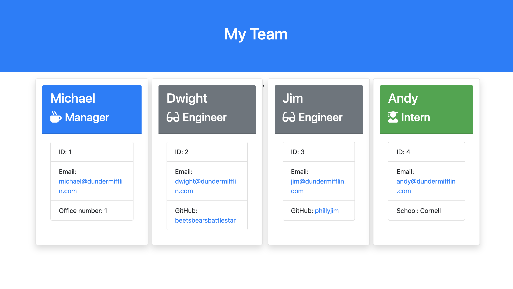

# Team Generator

## Table of Contents
[Description](#description) 
[Installation](#installation) 
[Test Instructions](#tests)   
[Authors](#authors)   
[Questions](#questions)   
[Demo](#demo) 
## Description
This application runs as a Node CLI to gather information about each employee on the team. The user is able to add managers, engineers, and interns to their team page. After all of the employees are entered into the command line, a team.html file will be written in the outputs folder. The user will be able to open that page in the browser to view their team! 
## Installation
The user will need to run npm install to install inquirer.
## Tests
Testing for the application uses jest.
## Authors
Kimberly Owens
## Questions
[Github](https://github.com/kimberlyj227) 
Email : kimberly.j.owens@gmail.com
## Demo

